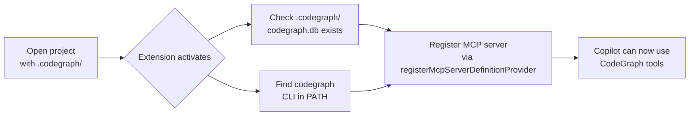

# CodeGraph Auto MCP

A VS Code extension that **automatically registers the [CodeGraph](https://github.com/svenzhao/codegraph) MCP server** when you open a project containing a `.codegraph/` directory.

## The Problem

[CodeGraph](https://github.com/svenzhao/codegraph) is a code intelligence tool that provides a [MCP (Model Context Protocol)](https://modelcontextprotocol.io) server for GitHub Copilot. When you open a project with `.codegraph/` initialized, you need the CodeGraph MCP server to be running so Copilot can use codegraph tools for context-aware code assistance.

However, VS Code has a [known bug](https://github.com/microsoft/vscode-copilot-release/issues/14166) (microsoft/vscode-copilot-release#14166) where **MCP servers configured in a global `mcp.json` do not auto-start**. The server only becomes available after manually reloading the window or re-triggering MCP discovery. This means every time you open a project, you have to manually intervene to get CodeGraph working — a poor developer experience.

## The Solution

This extension **automatically registers the CodeGraph MCP server** using the official VS Code API `registerMcpServerDefinitionProvider`. When you open a project that has `.codegraph/`, the extension:

1. Checks that `.codegraph/codegraph.db` exists (project is indexed)
2. Verifies the `codegraph` CLI is available in PATH
3. Registers the CodeGraph MCP server with VS Code — **no manual `mcp.json` configuration needed**

The MCP server starts automatically and Copilot can immediately use codegraph tools like `codegraph_explore`, `codegraph_node`, `codegraph_search`, and `codegraph_callers`.

## Features

- 🔄 **Auto-activation** — activates when opening any project that has `.codegraph/` (using `workspaceContains:.codegraph` activation event)
- ✅ **Dual validation** — checks both that `codegraph.db` exists and that the `codegraph` CLI is in PATH, preventing registration of a broken MCP server
- 🚀 **Zero config** — no `mcp.json` editing, no manual steps, no reload required
- 🌐 **Cross-platform** — works on macOS, Linux, and Windows (automatically detects `codegraph.cmd` on Windows)
- 📦 **Lightweight** — minimal code, zero runtime dependencies

## Installation

### From VSIX

1. Download the latest `.vsix` from [Releases](https://github.com/svenzhao/codegraph-auto-mcp/releases)
2. In VS Code, run **Extensions: Install from VSIX...**
3. Select the downloaded file

### From Source

```bash
git clone https://github.com/svenzhao/codegraph-auto-mcp.git
cd codegraph-auto-mcp
npm install
npm run build
```

Then press `F5` in VS Code to start debugging, or install the extension manually:

```bash
npm run build
code --install-extension codegraph-auto-mcp-0.0.1.vsix
```

## Usage

Once installed, the extension works automatically:

1. Open any project that has a `.codegraph/` directory with a `codegraph.db` file
2. Make sure the `codegraph` CLI is available in your PATH
3. The extension registers the CodeGraph MCP server — you can verify in VS Code's MCP server list
4. GitHub Copilot can now use CodeGraph tools (`codegraph_explore`, `codegraph_search`, `codegraph_node`, `codegraph_callers`) for code intelligence

### Requirements

- VS Code ^1.106.0 (with Copilot Chat)
- [CodeGraph CLI](https://github.com/svenzhao/codegraph) installed and in PATH
- A project with `.codegraph/` directory (initialized via `codegraph init`)

## How It Works



The extension calls `vscode.lm.registerMcpServerDefinitionProvider("codegraph", ...)` with a provider that returns a `McpStdioServerDefinition`. This tells VS Code to start the CodeGraph MCP server using:

```
codegraph serve --mcp --no-watch --path <workspace_root>
```

The server is registered with the ID `"codegraph"`, which matches the contribution in `contributes.mcpServerDefinitionProviders`.

## Building

```bash
npm run build      # compile TypeScript check + esbuild bundle
npm run compile    # same as build
npm run watch      # watch mode for development
```

## License

MIT
