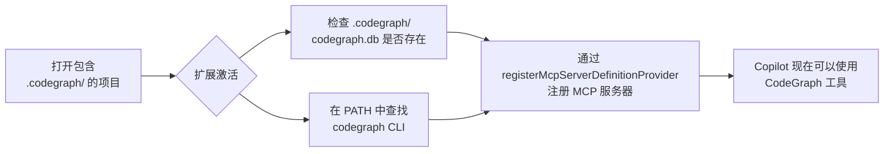

# CodeGraph Auto MCP

一个 VS Code 扩展，**在打开包含 `.codegraph/` 目录的项目时，自动注册 [CodeGraph](https://github.com/svenzhao/codegraph) MCP 服务器**。

## 问题

[CodeGraph](https://github.com/svenzhao/codegraph) 是一个代码智能工具，为 GitHub Copilot 提供 [MCP（模型上下文协议）](https://modelcontextprotocol.io) 服务器。当打开一个已初始化 `.codegraph/` 的项目时，需要 CodeGraph MCP 服务器正在运行，Copilot 才能使用 codegraph 工具进行上下文感知的代码辅助。

然而，VS Code 有一个[已知 Bug](https://github.com/microsoft/vscode-copilot-release/issues/14166)（microsoft/vscode-copilot-release#14166）：**在全局 `mcp.json` 中配置的 MCP 服务器不会自动启动**。服务器只有在手动重载窗口或重新触发 MCP 发现后才会可用。这意味着每次打开项目都需要手动干预才能让 CodeGraph 正常工作——开发体验非常糟糕。

## 解决方案

本扩展使用官方 VS Code API `registerMcpServerDefinitionProvider` **自动注册 CodeGraph MCP 服务器**。当打开一个包含 `.codegraph/` 的项目时，扩展会：

1. 检查 `.codegraph/codegraph.db` 是否存在（项目已索引）
2. 验证 `codegraph` CLI 是否在 PATH 中
3. 向 VS Code 注册 CodeGraph MCP 服务器——**无需手动配置 `mcp.json`**

MCP 服务器会自动启动，Copilot 可以立即使用 codegraph 工具，如 `codegraph_explore`、`codegraph_node`、`codegraph_search` 和 `codegraph_callers`。

## 特性

- 🔄 **自动激活**——打开任何包含 `.codegraph/` 的项目时自动激活（使用 `workspaceContains:.codegraph` 激活事件）
- ✅ **双重验证**——同时检查 `codegraph.db` 是否存在以及 `codegraph` CLI 是否在 PATH 中，防止注册有问题的 MCP 服务器
- 🚀 **零配置**——无需编辑 `mcp.json`，无需手动操作，无需重载窗口
- 🌐 **跨平台**——支持 macOS、Linux 和 Windows（自动检测 Windows 上的 `codegraph.cmd`）
- 📦 **轻量级**——代码精炼，零运行时依赖

## 安装

### 通过 VSIX 安装

1. 从 [Releases](https://github.com/svenzhao/codegraph-auto-mcp/releases) 下载最新的 `.vsix` 文件
2. 在 VS Code 中运行 **Extensions: Install from VSIX...**
3. 选择下载的文件

### 从源码构建

```bash
git clone https://github.com/svenzhao/codegraph-auto-mcp.git
cd codegraph-auto-mcp
npm install
npm run build
```

然后按 `F5` 在 VS Code 中启动调试，或手动安装扩展：

```bash
npm run build
code --install-extension codegraph-auto-mcp-0.0.1.vsix
```

## 使用方法

安装后，扩展会自动工作：

1. 打开任何包含 `.codegraph/` 目录且有 `codegraph.db` 文件的项目
2. 确保 `codegraph` CLI 在你的 PATH 中
3. 扩展会自动注册 CodeGraph MCP 服务器——你可以在 VS Code 的 MCP 服务器列表中验证
4. GitHub Copilot 现在可以使用 CodeGraph 工具进行代码智能分析

### 前提条件

- VS Code ^1.106.0（带 Copilot Chat）
- [CodeGraph CLI](https://github.com/svenzhao/codegraph) 已安装并在 PATH 中
- 项目已初始化 `.codegraph/` 目录（通过 `codegraph init`）

## 工作原理



扩展调用 `vscode.lm.registerMcpServerDefinitionProvider("codegraph", ...)`，提供一个返回 `McpStdioServerDefinition` 的 provider。这会告诉 VS Code 使用以下命令启动 CodeGraph MCP 服务器：

```
codegraph serve --mcp --no-watch --path <workspace_root>
```

服务器以 ID `"codegraph"` 注册，与 `contributes.mcpServerDefinitionProviders` 中的声明相匹配。

## 构建

```bash
npm run build      # TypeScript 编译检查 + esbuild 打包
npm run compile    # 同 build
npm run watch      # 开发模式监听文件变更
```

## 许可证

MIT
